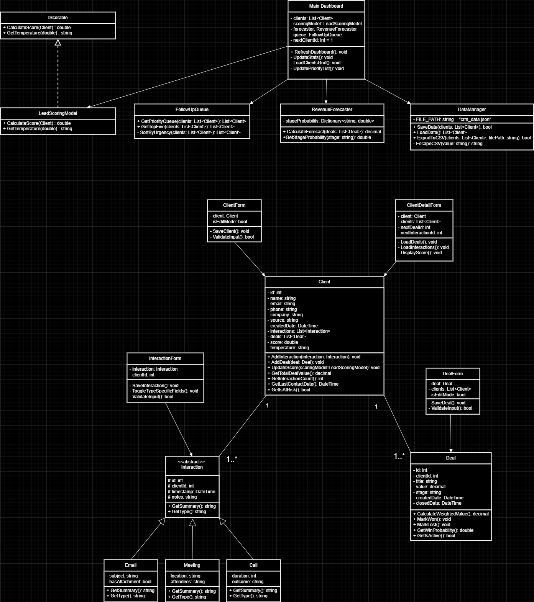

# ClientFlow CRM - Customer Relationship Manager for Freelancers

## Project Description and Purpose

ClientFlow CRM is a Windows Forms desktop application designed to help freelancers and solo professionals manage client relationships effectively. The system addresses the common problem of losing track of client conversations scattered across multiple platforms (Messenger, WhatsApp, email, SMS), forgetting follow-ups, and having no structured way to track sales deal progress.

The application provides a centralized platform where users can store client information, log interactions (calls, emails, meetings), track deals through a visual pipeline, and receive intelligent insights through lead scoring and revenue forecasting algorithms.

---

## UML Diagram



---

## Features and Functionalities

### Core Features
| Feature | Description |
|---------|-------------|
| Client Management | Add, edit, delete clients with name, email, phone, company, and source |
| Deal Tracking | Create and manage deals linked to clients with pipeline stages (Lead, Contacted, Quoted, Negotiation, Won, Lost) |
| Interaction Logging | Record calls, emails, and meetings with timestamps and notes |
| Data Persistence | Automatic save/load using JSON file storage |
| CSV Export | Export client data to CSV format for external use |

### Algorithmic Features
| Feature | Description |
|---------|-------------|
| Lead Scoring | Weighted algorithm scoring clients 0-10 based on Engagement (30%), Recency (40%), Deal Value (20%), and Source (10%) |
| Client Temperature | Auto-classifies clients as Hot (>=7.5), Warm (5.0-7.4), or Cold (<5.0) with color coding |
| Follow-Up Queue | Prioritized list of clients sorted by temperature, days since contact, and deal value |
| Revenue Forecasting | Predicts expected income using deal values multiplied by stage win probabilities |
| Inactivity Alerts | Flags clients with no contact for more than 14 days |

### Dashboard Display
- Total clients count
- Active deals count
- Forecasted revenue
- Pending follow-ups
- Top 5 priority follow-up list
- At-risk client alert count
- Color-coded client grid (Red = Hot, Orange = Warm, Blue = Cold)

---

## Explanation of How the Program Works

### System Architecture
The application follows a layered architecture with four main components:

1. **Models Layer** - Data entities (Client, Deal, Interaction)
2. **Algorithms Layer** - Business logic (LeadScoringModel, RevenueForecaster, FollowUpQueue)
3. **Data Layer** - File operations (DataManager for JSON save/load)
4. **Presentation Layer** - Windows Forms (MainDashboard, ClientForm, ClientDetailForm, DealForm, InteractionForm)

### Application Flow
1. User launches the application
2. DataManager loads existing clients from JSON file
3. Lead scoring algorithm calculates scores for all clients
4. Main Dashboard displays statistics, priority list, and client grid
5. User can add, edit, or delete clients, deals, and interactions
6. All changes are automatically saved to JSON file
7. Dashboard refreshes with updated calculations after every action

### Lead Scoring Algorithm
Score = (Engagement x 0.30) + (Recency x 0.40) + (Value x 0.20) + (Source x 0.10)

Where:
- Engagement: Number of interactions (max 10)
- Recency: Days since last contact (<=3d=10, <=7d=7, <=14d=5, <=30d=3, >30d=1)
- Value: Total deal value (>=50000=10, >=25000=7, >=10000=5, >=5000=3)
- Source: Referral=10, Social=7, Website=5, Cold=3

### Revenue Forecast Algorithm
Forecast = Sum of (Deal Value x Stage Win Probability)

Stage Probabilities:
Lead = 10% | Contacted = 25% | Quoted = 50%
Negotiation = 75% | Won = 100% | Lost = 0%

---

## OOP Principles Implementation

### Encapsulation
- **Client.cs**: Private fields (_name, _email, _phone, _company, _source) with public properties that include validation in setters
- **Deal.cs**: Properties with controlled access and calculated field updates through UpdateCalculatedFields() method
- **DataManager.cs**: Static class encapsulating all file I/O operations away from the UI layer

### Inheritance
- **Interaction.cs**: Abstract base class inherited by Call, Email, and Meeting classes
- Each subclass inherits common properties (Id, ClientId, Timestamp, Notes) while adding type-specific fields
- Call adds Duration and Outcome, Email adds Subject, Meeting adds Location and Attendees

### Polymorphism
- **Method Overloading**: ClientForm has two constructors, one for adding new clients (empty form) and one for editing existing clients (pre-filled form)
- **Method Overriding**: UpdateSummary() is implemented differently by Call, Email, and Meeting subclasses to generate type-specific summary text
- **Abstract Methods**: Type property and UpdateSummary() method defined in abstract Interaction class, implemented by each subclass

### Abstraction
- **Abstract Class**: Interaction defines the blueprint for all interaction types without exposing implementation details
- **Static Class**: DataManager abstracts file operations (save, load, export) from the rest of the application
- **Separation of Concerns**: Algorithm classes (LeadScoringModel, RevenueForecaster, FollowUpQueue) provide clean separation of business logic from UI

---

## Instructions on How to Run the Application

### Prerequisites
- Windows 10 or Windows 11
- .NET Framework 4.8 or higher
- Visual Studio 2022 (Community Edition or higher)

### Steps to Run
1. Clone the repository:
   git clone https://github.com/ALfish152/ClientFlowCRM.git
3. Open ClientFlowCRM.sln in Visual Studio
4. Restore NuGet packages (right-click Solution, then Restore NuGet Packages)
5. Build the solution (Ctrl+Shift+B)
6. Run the application (F5)

### Required NuGet Packages
- Newtonsoft.Json (for JSON serialization and deserialization)

### Data Storage
- Client data is automatically saved to Documents\ClientFlowCRM\clients.json
- Data persists between application sessions
- To reset all data, delete the clients.json file and restart the application

---

## Developers

- **Aeron A. Almira**
- **Jmar C. Oliver**
- **Ken G. Mendoza**

---

## Project Structure

```
ClientFlowCRM/
├── Models/
│   ├── Client.cs
│   ├── Deal.cs
│   └── Interaction.cs
├── Forms/
│   ├── ClientForm.cs
│   ├── ClientDetailForm.cs
│   ├── DealForm.cs
│   └── InteractionForm.cs
├── Algorithms/
│   ├── LeadScoringModel.cs
│   ├── RevenueForecaster.cs
│   └── FollowUpQueue.cs
├── Data/
│   └── DataManager.cs
├── MainDashboard.cs
├── MainDashboard.Designer.cs
└── Program.cs
```
